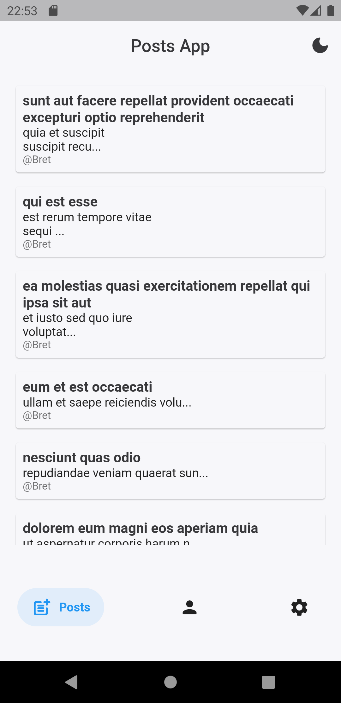
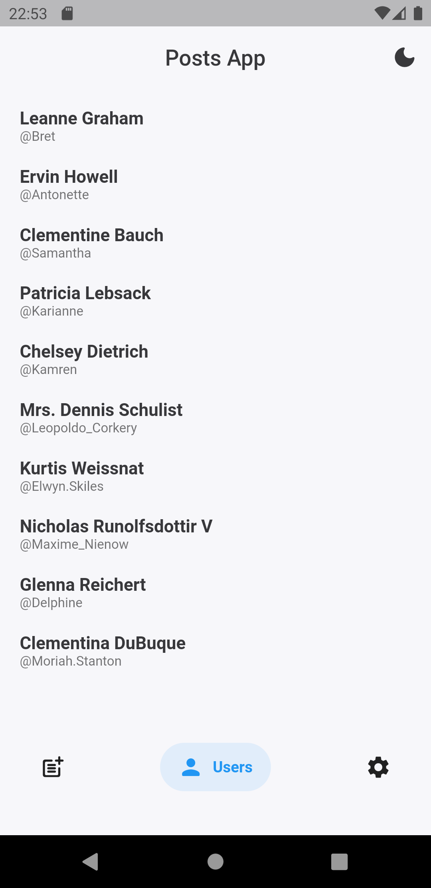
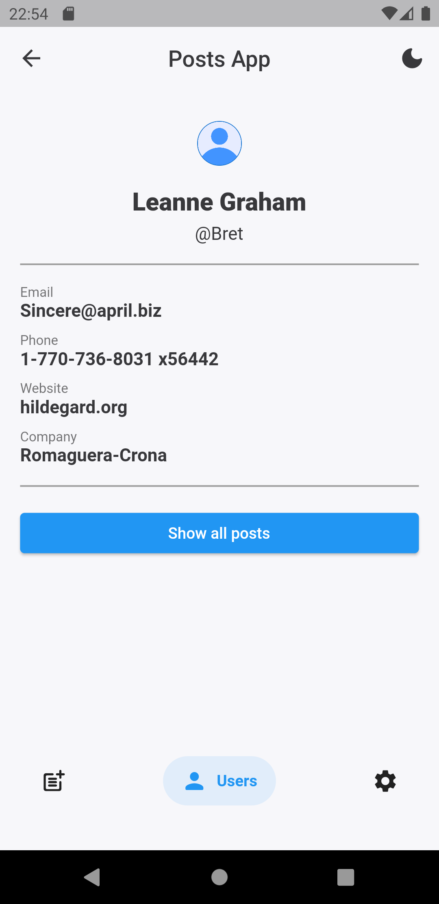
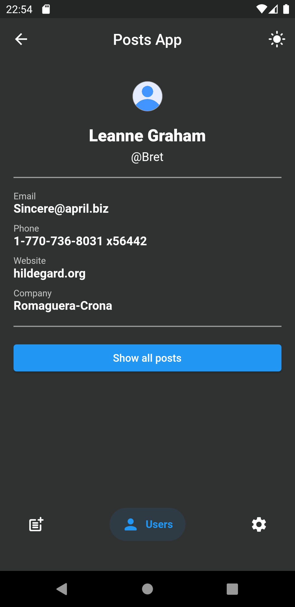

# Simple Posts App

## Demo

  &nbsp;&nbsp;&nbsp;&nbsp;
  &nbsp;&nbsp;&nbsp;&nbsp;
  &nbsp;&nbsp;&nbsp;&nbsp;
  &nbsp;&nbsp;&nbsp;&nbsp;

## Functionality

### • Auto Route
It's a navigation package, it allows for strongly-typed arguments passing, effortless deep-linking and it uses code generation to simplify routes setup, with that being said it requires a minimal amount of code to generate everything needed for navigation inside of your App.

Source: [Auto Route Library](https://pub.dev/packages/auto_route)  

### • API Requests

Remote API requests with the help of free online REST API with fake posts and users.  
[JSONPlaceholder](https://jsonplaceholder.typicode.com/) is a free online REST API that you can use whenever you need some fake data. It can be in a README on GitHub, for a demo on CodeSandbox, in code examples on Stack Overflow, ...or simply to test things locally.

### • Custom Light & Dark Theme
